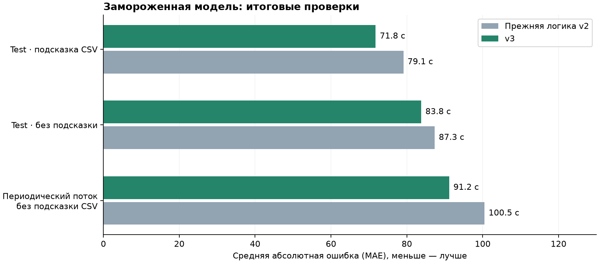

# ML-IMPROVE-12: исследование и модель v3

27.09.2026. Выбрана и поставлена новая регрессия v3: **71,7707 с MAE** на 353 test-точках
против 79,0874 с у v2 (**−9,25%**). Автономный periodic event-time replay также улучшился:
100,4563 → 91,1775 с (**−9,24%**) относительно прежней логики estimated-hint + fallback.
Числа относятся к разным проверкам; это не обещание ошибки 72 секунды в любом live-потоке.

## Почему потребовалась новая проверка

V2 выигрывала на обычном test, но прежний vehicle holdout этого преимущества не подтвердил.
Кроме того, backend подавал оценку GPS в поле, на точной CSV-подсказке которого обучалась
main-модель. Эта оценка шумная и не эквивалентна supplied `cur_dev_s`. Цель исследования:
улучшить signed регрессию отдельно с supplied hint и без неё, не подбираясь к test/validate.

## Протокол до экспериментов

- 1141 real train точка, 13 ТС. 3293 синтетических точки исключены: родительские семейства
  неизвестны, нельзя исключить утечку через копии траекторий.
- Для итоговой проверки зарезервированы **122613, 130238, 131672**: 206 точек. Выбор по ID,
  seed 20260927, из ТС, не входивших в прежний ML-02 holdout. Их исходы не участвовали
  в подборе или fit в этой работе. Сам датасет исторически использовался при обучении v2:
  это новая процедура резервирования, а не совершенно новый внешний набор данных.
- На оставшихся 935 точках: 5 folds целых ТС и 2 forward folds (12:00–17:00, 17:00–24:00).
  В forward fit используются только T **строго раньше** границы минус 30 минут и исходы,
  наступившие до границы. 30 минут отделяют окна новых признаков; target используется
  здесь только как metadata доступности label, а не как признак.
- Критерий выбора: среднее двух pooled MAE — group и forward. Ни early stopping,
  ни подбор по внешнему holdout/test не выполнялись. Числа development оптимистичны,
  потому что использованы для выбора.
- Рецепт из шести моделей заморожен перед первым внешним сравнением. Затем выполнен refit
  на всех 1141 real train точках и один итоговый test; дальнейшего tuning по нему не было.
- Validate используется только для генерации submission без labels. Test/validate traffic
  совпадают, поэтому факты расписания запрещены в признаках и в любых обходных joins.

[Протокол](../experiments/improve12-protocol.json),
[109 конфигураций](../experiments/improve12-candidates.json),
[таблица всех результатов подбора](ml-v3-candidates.csv),
[замороженный рецепт](../experiments/improve12-recipe.json).

## Итерации

| Раунд | Проверено | Вывод |
|---|---:|---|
| Признаки и глубина | 50 конфигураций | Контекст плана улучшил оба режима; абсолютные координаты/время не всегда вредили переносу |
| Loss и регуляризация | 38 конфигураций | RMSE/Huber не дали устойчивого преимущества над MAE; очень глубокие/длинные модели не помогли |
| Дополнительные моменты прогноза | 9 конфигураций | 1967 дополнительных T для 935 известных train-targets; убедительного выигрыша нет, в v3 не включены |
| Случайные seeds | 12 конфигураций | Seeds 73/101 подтвердили пользу контекста, но не дали причины увеличивать ансамбль до девяти моделей |
| Ансамбли | Равновесные пары/тройки лучших вариантов | Три разные конфигурации дали небольшой дополнительный выигрыш |

Каждая из 109 отдельных конфигураций проверена на 7 folds: **763 fit** только для
основного поиска. Дополнительные T не создавали новых labels из расписания, оставались
в fold родительского target, не переносили supplied hint из будущего и сохраняли
суммарный вес исходной цели. Код эксперимента сохранён для воспроизведения, но этот
приём не входит в итоговый рецепт. Добавление augmentation в лучший fallback-ансамбль
меняло критерий менее чем на 0,05 с; выбрана более простая версия без augmentation.

| MAE подбора, с | V2: тот же рецепт, refit по folds | V3 ансамбль |
|---|---:|---:|
| Main: group / forward | 79,7552 / 80,0921 | 76,4096 / 75,5264 |
| Main: средний критерий | 79,9237 | **75,9680** |
| Fallback: средний критерий | 92,8083 | **84,7261** |

Это сравнение фиксированной регрессии v2, переобученной на каждом fold, а не применение
готовой v2 к уже виденным ею train labels. Не смешивать его с ML-02, где заново выбиралась
сама процедура обучения на другом наборе ТС.

## Что входит в v3

Одна библиотека признаков, schema **2**, 73 числовых признака. Сохранены 44 исходных;
добавлены 29 признаков:

- положение GPS относительно плановой последовательности и схематических сегментов;
- расстояние до соответствия, оценка текущего смещения по сегменту, согласие направления;
- последние наблюдаемые прохождения остановок, их возраст, изменения и медиана отклонения;
- количество оставшихся плановых посещений, длина схемы и требуемая средняя скорость;
- путь по GPS, скорость/простой с весом длительности, покрытие времени наблюдениями.

Геометрия — **не дорожный маршрут**. Совпадение дальше 200 м не превращается в численное
смещение по сегменту, наблюдаемое посещение требует GPS в радиусе 60 м. Возраст, расстояние
и пропуски остаются отдельными признаками. Окно истории ограничено 1800 с, события после T
не участвуют; большие разрывы не интерполируются как непрерывное движение.

Main: residual к supplied `cur_dev_s`, depth 6/full + depth 4/full + depth 4/compact,
по 300 деревьев. Fallback: direct target, depth 6/compact/300 + depth 4/full/700 +
depth 2/compact/300. Веса по 1/3, learning rate 0,05, MAE, L2=5, seed 42, CPU 4 threads.
Raw ID не являются признаками; отрицательные predictions разрешены.

Backend читает schema/config из ML API. В v3 `hint_policy=supplied_only`: GPS-оценка
больше не маскируется под точную CSV-подсказку. Автономная модель видит GPS-оценки и их
качество через отдельные признаки. Текущая обводка ТС остаётся отдельным наблюдаемым
индикатором, не результатом новой регрессии.

Классификаторы риска и Platt-параметры сохранены из v2. Поэтому Brier и калибровка не
объявляются улучшенными; статус `fitted_on_development` сохранён. Точность регрессии и
достоверность вероятности — отдельные характеристики.

## Итоговые проверки замороженной модели

| Протокол | V2 / прежняя логика | V3 MAE, с |
|---|---:|---:|
| Отложенные 3 ТС, 206 точек, supplied | 76,9720 | **74,3725** |
| Те же ТС, без supplied | 88,3703 | **73,5623** |
| Полный test, 353 точки, supplied | 79,0874 | **71,7707** |
| Полный test, 353 точки, без supplied | 87,3271 | **83,7950** |
| Периодический replay, без supplied, 1311 оценённых прогнозов | 100,4563 estimated + fallback | **91,1775** |

Внешний holdout неоднороден: main улучшилась на 2/3 ТС, на 131672 ухудшилась
102,67 → 104,29 с; fallback улучшилась на всех трёх. Нулевой прогноз на этом holdout имеет
MAE **74,0 с**: main v3 чуть хуже него, fallback v3 чуть лучше. Это важное ограничение:
улучшение относительно v2 не означает превосходство над любым baseline на любом срезе.
[Предикты внешней проверки](ml-v3-holdout-predictions.csv).

На test main улучшилась на 10/13 ТС. Bootstrap целыми ТС (10000 повторов, seed 20260927):
выигрыш 7,32 с, ориентировочный 95% интервал **[3,27; 11,25] с**. Fallback улучшилась
на 6/13 ТС: выигрыш 3,53 с, интервал **[−4,01; 10,58] с** включает отсутствие улучшения.
Всего 13 групп, один день и пересечения исходной раздачи: эти интервалы не доказывают
перенос на другой день. [Расчёт неопределённости](ml-v3-uncertainty.json).

### Автономный periodic replay

`transport_backend.live_evaluation` читает телеметрию по event_time, хранит 1800 с / 900
событий на ТС, каждые 30 с выбирает цель из плана и использует только уже пришедший prefix.
**Прогнозные точки и supplied hints не читаются для inference.** Labels присоединяются
после сохранения всех прогнозов, исключительно для оценки.

- 15077 прогнозов из 16472 плановых возможностей; 1361 stale, 34 warming-up.
- Оценены 1311 прогнозов для **322/353 размеченных посещений**, покрытие 91,2%.
  Остальные плановые посещения не имеют label в `labels_test` и не оцениваются.
- MAE с равным весом посещения: 96,4139 → **90,2839 с**. Это дополняет MAE по строкам,
  поскольку несколько прогнозов одного посещения зависимы.
- Прежняя модель всегда без hint на этих же строках: 94,7943 с; новый fallback: 91,1775 с.
- Время всего прогона: 114,5 с. Batch признаков и трёх сравниваемых режимов на этой машине:
  p50 35,3 мс, p95 43,2 мс. Это не отдельная production-метрика ML HTTP.
- Медианный lead от source cutoff до фактического прибытия 737 с, минимум 354 с;
  86,4% не меньше 600 с. При раннем прибытии фактический lead меньше планового горизонта.
  Не выдавать эту величину за измеренный lead от реальной публикации.

[Полный автономный отчёт](ml-v3-autonomous.json). Это bounded event-time эксперимент,
не TCP/HTTP/очереди и не wall-clock latency benchmark. Доставка, reconnect, реальная
публикация и независимый следующий день остаются отдельными проверками.

## Почему возможны неправдоподобные прогнозы далеко от остановки

На inner train обнаружен пример со свежим GPS (9 с), расстоянием **19,98 км**, горизонтом
660 с и label **−34 с**. Для прибытия в указанное фактическое время нужна средняя скорость
около 115 км/ч даже по прямой. Это сомнительное соответствие телеметрии и плана,
которое статистическая регрессия сама исправить не может. Значительная часть других
дальних примеров связана с устаревшей позицией.

Поэтому v3 не обещает физически достоверный ETA при произвольном случайном GPS.
Улучшение MAE не заменяет проверку применимости: нужны надёжное сопоставление с рейсом,
дорожная геометрия и политика отображения неопределённого прогноза. Случайное движение
официального эмулятора проверяет транспорт данных, но не точность реального маршрута.
Новая версия не вводит произвольный нижний предел задержки и не меняет исходные labels.

## Воспроизводимость и поставка

Команды — в [ML README](../README.md). Сохранены модели, рецепт, source/data/model hashes,
таблица всех кандидатов, внешние predictions, test predictions и готовый validate CSV.
Повторный запуск formal CLI воспроизвёл main/fallback/augmentation-кандидатов с максимальной
разницей 0,0; внешний holdout и финальный refit совпали в пределах 1e−12 с.

- **131 Python-тест**, Ruff check/format ML и Backend.
- Causal cutoff +1 нс, отсутствие фактов в признаках, горизонт, batch/stream prefix parity,
  no-hint routing, ансамбли, schema 1/2, NDTP и API покрыты проверками.
- Три Docker-сервиса собраны и healthy; ML API сообщает schema 2, 73 признака и
  `supplied_only`; CSV replay выдал успешные предикты schema 2.
- Новый submission: UTF-8, `;`, ровно 151 ID, без NaN/inf/дублей, signed прогнозы.
- V1/v2 и raw CSV не менялись. Отправка на платформу не выполнялась; нового platform score нет.

Методические первичные источники:
[CatBoost: MAE/RMSE/Huber](https://catboost.ai/docs/en/concepts/loss-functions-regression),
[scikit-learn: групповые и временные проверки](https://scikit-learn.org/stable/modules/cross_validation.html).
Они обосновывают проверяемые варианты и разделение данных; измеренный выигрыш получен
из экспериментов проекта, а не следует из документации библиотек.

Интеграционный smoke NDTP на 60×: 2888 прогнозов, 423 запроса к ML, errors/timeouts 0/0;
ML inference p95 9,62 мс, полный HTTP round trip p95 18,84 мс. Очередь/карта/карточка
и системная панель проверены в браузере; официальный эмулятор восстановлен.
[Условия и сохранённые счётчики](../../docs/PERFORMANCE.md#ml-v3--27092026).
